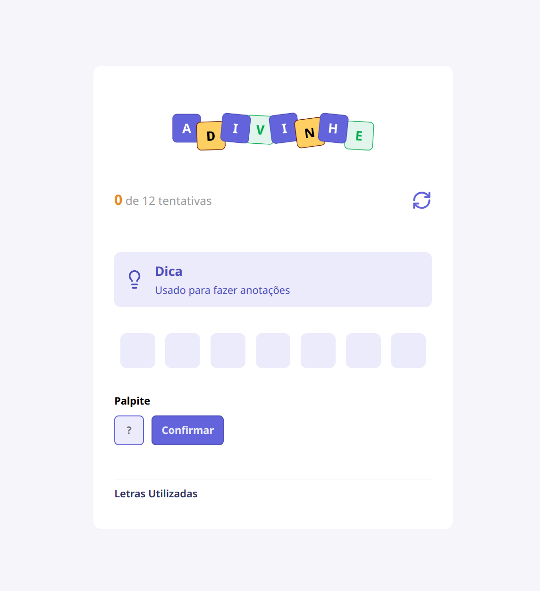
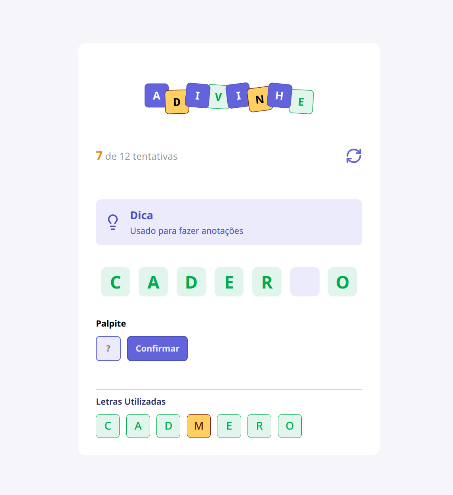
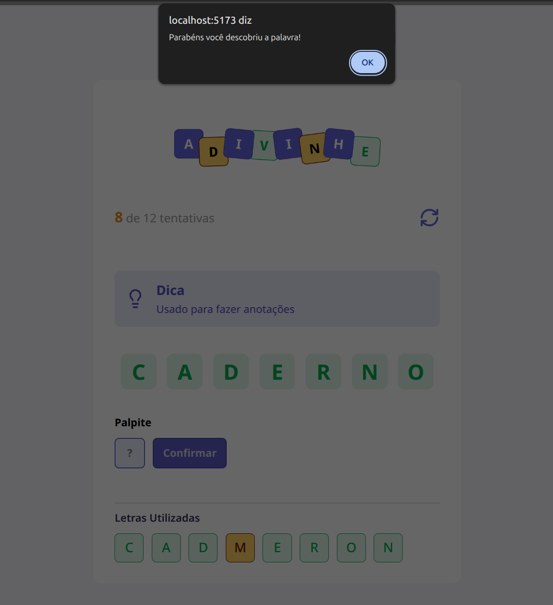
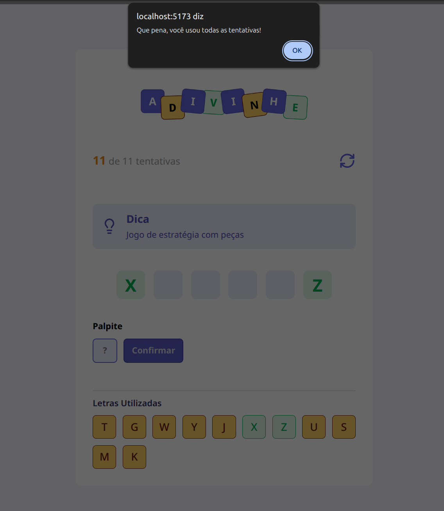

# 🎯 Adivinhe

<p align="center">
  
</p>

<p align="center">
  Um jogo Web para adivinhar palavras desenvolvido com <strong>React</strong> para praticar os principais conceitos da biblioteca.
</p>

---

## 📖 Sobre o projeto

O **Adivinhe** é um jogo Web onde o jogador deve descobrir uma palavra secreta digitando uma letra por vez.

A cada tentativa o sistema informa se a letra faz parte da palavra, exibindo as letras corretas e registrando todas as tentativas realizadas. O jogador vence ao revelar toda a palavra antes de atingir o limite de tentativas.

O projeto foi desenvolvido com o objetivo de aplicar e consolidar os fundamentos do React, utilizando componentes reutilizáveis, gerenciamento de estado com Hooks e boas práticas de organização de código.

---

## ✨ Funcionalidades

- ✅ Seleção aleatória de palavras
- ✅ Sistema de dicas
- ✅ Tentativas limitadas
- ✅ Histórico de letras utilizadas
- ✅ Indicação de letras corretas e incorretas
- ✅ Contador de progresso
- ✅ Reinício da partida
- ✅ Interface responsiva
- ✅ Componentização da interface

---

## 🧠 Conceitos praticados

Durante o desenvolvimento foram aplicados diversos conceitos importantes do React, como:

- Componentização
- Props
- State (`useState`)
- Effects (`useEffect`)
- Eventos
- Renderização condicional
- Renderização de listas (`map`)
- Atualização imutável de estados
- Tipagem com TypeScript
- CSS Modules
- Organização de componentes
- Lógica de negócio separada da interface

---

## 🛠️ Tecnologias

- React
- TypeScript
- Vite
- CSS Modules

---

## 📂 Estrutura do projeto

```
src
├── components
│   ├── Button
│   ├── Header
│   ├── Input
│   ├── Letters
│   ├── LettersUsed
│   └── Tip
│
├── utils
│   └── words.ts
│
├── App.tsx
├── main.tsx
└── app.module.css
```

---

## 📸 Screenshots

### Tela inicial



---

### Durante a partida



---

### Vitória



---

### Derrota



---

## 🚀 Como executar

Clone o repositório

```bash
git clone https://github.com/Matheus-Souza97/adivinhe.git
```

Entre na pasta

```bash
cd adivinhe
```

Instale as dependências

```bash
npm install
```

Execute o projeto

```bash
npm run dev
```

A aplicação estará disponível em:

```
http://localhost:5173
```

---

## 🎮 Como jogar

1. Leia a dica exibida na tela.
2. Digite uma letra.
3. Clique em **Confirmar**.
4. Letras corretas serão reveladas.
5. Letras erradas também ficam registradas.
6. Descubra toda a palavra antes de atingir o limite de tentativas.

---

## 📚 Aprendizados

Este projeto foi desenvolvido para reforçar conhecimentos em React, especialmente:

- gerenciamento de estado;
- comunicação entre componentes;
- manipulação de eventos;
- renderização dinâmica;
- organização de aplicações React com TypeScript.

---

## 👨‍💻 Autor

Desenvolvido por **Matheus Souza**
